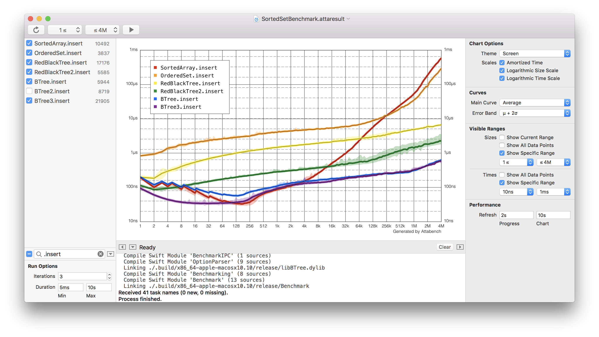
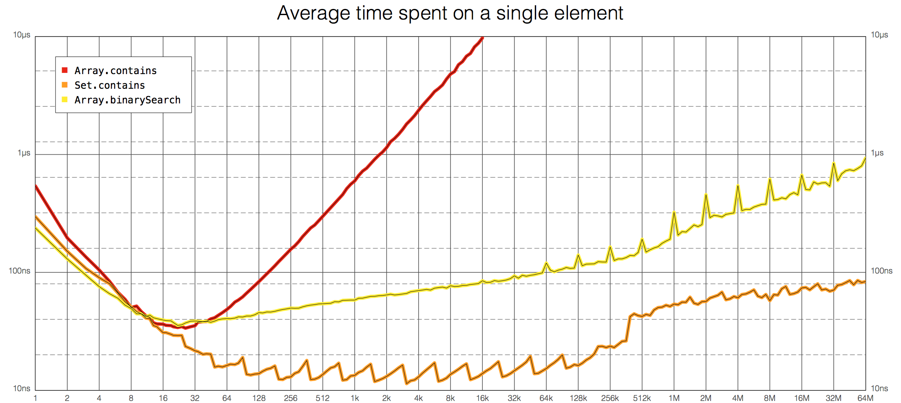

[](https://developer.apple.com/xcode/)
[](https://swift.org/)
[](https://developer.apple.com/platforms/)
[](https://travis-ci.org/attaswift/Attabench)

| :warning: WARNING          |
|:---------------------------|
| This package has been largely superseded by the [Swift Collections Benchmark package](https://github.com/apple/swift-collections-benchmark). That package provides a portable benchmarking solution that works on all platforms that Swift supports, and it is being maintained by the Swift Standard Library team.|


Attabench is a microbenchmarking app for macOS, designed to measure
and visualize the performance of Swift code.



### Table of Contents

- [Background](#background)
- [Installation](#installation)
- [Usage](#usage)
- [Control What Gets Measured](#control-what-gets-measured)
- [Change How Data Gets Displayed](#change-how-data-gets-displayed)
- [Get Chart Images Out of Attabench](#get-chart-images-out-of-attabench)
- [Create Your Own Benchmarks](#create-new-benchmarks)
- [Get Surprised by Results](#get-surprised-by-results)
- [Internal Details: The Attabench Protocol](#internal-details-the-attabench-protocol)

## Background

This app is for microbenchmarking low-level algorithms with one degree of freedom (usually size).
It works by repeatedly performing the same operation on random data of various sizes, while continuously charting the results in nice plots. Attabench's default log-log plots are ideal for seeing your algorithm's performance at a glance.

Attabench was originally created to supply nice log-log charts for my [dotSwift 2017 talk][dotswift] and [Optimizing Collections][oc] book. At the time, it seemed easier to build a custom chart renderer from scratch using Core Graphics than to mess with a bunch of CSV files and pivot tables in Excel. (It has to be noted though that this opinion has been somewhat weakened during the implementation process.)

[dotswift]: https://speakerdeck.com/lorentey/optimizing-swift-collections
[oc]: https://www.objc.io/books/optimizing-collections/

Attabench was made in a hurry for a single use case, so its code is
what polite people might call *a little messy*. But it's shockingly fun to play with, and the graphs
it produces are chock full of strange and wonderful little mysteries.

If you find Attabench useful in your own project, please consider [buying a copy of my book][oc]!
It contains a *lot* of benchmarks made with Attabench; I'm positive you'll find it entertaining and informative.

## Installation

Follow these steps to compile Attabench on your own:

1. Clone this repo to your Mac.

    ```
    git clone https://github.com/attaswift/Attabench.git Attabench --recursive
    cd Attabench
    ```

2. Install [Carthage][carthage] if you don't already have it. (This assumes you have [Homebrew][brew] installed.)

    ```
    brew install carthage
    ```

3. Retrieve and build dependencies ([SipHash][siphash], [BTree][btree] and [GlueKit][gluekit]).

    ```
    carthage bootstrap --platform Mac
    ```

4. Open the project file in Xcode 9, then build and run the Attabench target.

    ```
    open Attabench.xcodeproj
    ```

[carthage]: https://github.com/Carthage/Carthage
[brew]: https://brew.sh
[siphash]: https://github.com/attaswift/SipHash
[btree]: https://github.com/attaswift/BTree
[gluekit]: https://github.com/attaswift/GlueKit

## Usage

Attabench has two document formats: a benchmark document defining what to test (with the extension `.attabench`), and a results document containing benchmark timings (extension `.attaresult`). Results documents remember which benchmark they came from, so you can stop Attabench and restart any particular benchmark run at any point. You may create many result documents for any benchmark.

When the app starts up, it prompts you to open a benchmark document. Each benchmark contains executable code for one or more individually measurable tasks that can take some variable input. The repository contains two examples, so you don't need to start from sratch:

- **SampleBenchmark.attabench** is a simple example benchmark with just three tasks. It is a useful starting point for starting your own benchmarks.

- **OptimizingCollections.attabench** is an example of a real-life benchmark definition. It was used to generate the charts in the Optimizing Collections book. (See if you can reproduce my results!)

We are going to look at how to define your own benchmark files later; let's just play with the app first.

Once you load a benchmark, you can press <kbd>⌘-R</kbd> to start running benchmarks with the parameters displayed in
the toolbar and the left panel. The chart gets updated in real time as new measurements are made.


You can follow the benchmarking progress by looking at the status bar in the middle panel. Below it there is a console area that includes Attabench status messages. If the benchmark prints anything on standard output or standard error during its run, that too will get included in the console area.

## Control What Gets Measured

You can use the checkboxes in the list inside the left panel to control which tasks get executed. If you have many tasks, you can filter them by name using the search field on the bottom. (You can build simple expressions using negation, conjunction (AND) and disjunction (OR) -- for example, typing `dog !brown, cat` in the search field will get you all tasks whose name includes either `dog` but not `brown`, or it includes `cat`.) To check/uncheck many tasks at once, just select them all and press any of their checkboxes.

The two pop up buttons in the tool bar lets you select the size interval on which you want to run your tasks. Attabench will smoothly sample the interval on a logarithmic curve that perfectly fits the charts.

While there is an active benchmark running, whenever you change something on the left side of the window, the benchmark is immediately stopped and restarted with the new parameters. This includes typing anything in the search bar -- only visible tasks get run. Be careful not to interrupt long-running measurements.

The run options panel in the bottom controls how many times any particular task is executed before a measurement is reported. As a general rule, the task is repeated *Iterations* times, and the fastest result is used as the measurement. However, when the *Min Duration* field is set, each task will keep repeating until the specified time has elapsed; this smooths out the charts of super quick benchmarks that would otherwise have really noisy results. On the other hand, a task will not get repeated when it has cumulatively taken more time than the time interval in *Max Duration* field. (This will get you results quicker for long-running tasks.) So with the *Duration* fields, any particular task may get run for either more or less times than what you set in the *Iteration* field.

## Change How Data Gets Displayed

The right panel is used to configure how the chart is rendered. Feel free to experiment by tweaking these controls; they only change the appearance of how the results get displayed; they do not affect any currently running benchmark.

The pop up button on the top lets select one from a handful of built-in visual themes to radically change the chart's appearance. For example, the *Presentation* theme is nice for white-on-black presentation decks. (You currently need to modify the source of the app if you need to change these themes or create your own.)

The three *Scales* checkboxes lets you enable/disable amortized time display or switch to linear scales on any of the two axes. These are occasionally useful.

The *Curves* panel includes two pop up buttons for selecting what data to display. For the actual curves, you can choose from the following kinds of data:

- *None* to disable the curve altogether
- *Minimum* to show the minimum of all collected measurements.
- *Average* selects the arithmetic mean of collected samples. This is often the most informative, so this is the default choice.
- *Maximum* displays the slowest measurement only. This is probably not that useful on its own, but it was really cheap to implement! (And it can be interesting to combine it with the stddev-based error bands.)
- *Sample Count* is the odd one out: it displays the count of measurements made, not their value. This is a bit of a hack, but it is very useful for determining if you have taken enough measurements. (To get the best view, switch to a linear "time" scale.)

There is also an optional *Error Band* that you can display around each curve. Here are the available options for these bands:

- *None* disables them. This is the minimalist choice.
- *Maximum* paints a faintly colored band between the minimum and maximum measured values.
- The *μ + σ* option replaces the maximum value with the sum of the average and the standard deviation. (This is the 68% in the [68-95-99.7 rule][sigmas].)
- *μ + 2σ* doubles the standard deviation from the previous option. ("95%")
- *μ + 3σ* goes triple. ("99.7%")

[sigmas]: https://en.wikipedia.org/wiki/68–95–99.7_rule

The bottom band is always set to the minimum value, in all cases except *None*. (E.g., *μ - σ* can easily go below zero, which looks really bad on a log scale.)

A word of warning: I know nothing about statistics, and I'm not qualified to do proper statistical analysis. I chose these options because they produced cool-looking charts that seemed to tell me something meaningful about the spread of the data. These sigma expressions look suitably scientific, but they are likely not the greatest choice for benchmarking. (I'm pretty sure benchmark measurements don't follow a normal distribution.) If you do know this sort of thing, please submit a PR to fix things!

The *Visible Ranges* panel lets you select what ranges of values to display on the chart. By default, the chart is automatically scaled to fit all existing measurements for the active tasks and the entire active range. Setting specific ranges is useful if you need to zoom into a part of the chart; sorry you can't do this directly on the chart view.

Finally, the two *Performance* fields lets you control how often Attabench updates the UI status and how often it redraws the chart. If results come too quickly, the CPU spent on Attabench's UI updates could easily affect measurements.

## Get Chart Images Out of Attabench

To get a PNG version of the current chart, simply use the mouse to drag the chart into Finder or another app. Attabench also includes a command-line tool to automate the rendering of charts -- check out the `attachart` executable target in the Swift package. You can use it to prevent wrist fatigue when you need to generate more than a handful of images. (Saving the command line invocations into a script will also let you regenerate the whole batch later.)


## Create Your Own Benchmarks

90% the fun of Attabench is in defining and running your own benchmarks. The easiest way to do that is to make a copy of the included `SampleBenchmark.attabench` benchmark and then modify the code in it.

### Anatomy of an Attabench Benchmark Document

An `.attabench` document is actually a folder containing the files needed to run the benchmark tasks. The only required file is `run.sh`; it gets executed every time Attabench needs to run a new measurement. [The one in `SampleBenchmark`][run.sh] uses the Swift Package Manager to build and run the Swift package that's included in the folder. (You can define benchmarks in other languages, too; however, you'll need to implement the Attabench IPC protocol on your own. Attabench only provides a [client implementation in Swift][Benchmarking-pkg].)

[run.sh]: ./SampleBenchmark.attabench/run.sh
[Benchmarking-pkg]: https://github.com/attaswift/Benchmarking

### Defining Tasks in Swift

`SampleBenchmark` contains a Swift package that is already set up to run benchmarks in Attabench; you only need to replace the example tasks with your own ones.

(To help you debug things, you may want to build the package in Terminal rather than inside Attabench. It is a normal Swift package, so you can build it and run it on its own. It even contains a set of command line options that you can use to run benchmarks directly from the command line -- this is extremely useful when you need to debug something about a task.)

To help you get started, let's describe the tasks that `SampleBenchmark` gives you by default.

To define a new benchmark, you need to create a new instance of the `Benchmark<Input>` generic class and add some tasks to it.
    
```swift
public class Benchmark<Input>: BenchmarkProtocol {
    public let title: String
    public var descriptiveTitle: String? = nil
    public var descriptiveAmortizedTitle: String? = nil

    public init(title: String, inputGenerator: @escaping (Int) -> Input)
    public func addTask(title: String, _ body: @escaping (Input) -> ((BenchmarkTimer) -> Void)?)    
}
```

Each benchmark has an `Input` type parameter that defines the shared
input type that all tasks in that benchmark take. To create a
benchmark, you also need to supply a function that takes a size (a
positive integer) and returns an `Input` value of that size,
typically using some sort of random number generator.

For example, let's create a simple benchmark that measures raw lookup
performance in some standard collection types. To do that, we need to
generate two things as input: a list of elements that the collection should contain, and a sequence of lookup operations to perform.
We can represent both parts by randomly shuffling integers from 0 to `size - 1`, so that the order in which we insert elements into the collection will have no relation to the order we look them up:

```swift
let inputGenerator: (Int) -> (input: [Int], lookups: [Int]) = { size in
    return ((0 ..< size).shuffled(), (0 ..< size).shuffled())
}
```

Now that we have an input generator, we can start defining our benchmark:

```swift
let benchmark = Benchmark(title: "Sample", inputGenerator: inputGenerator)
benchmark.descriptiveTitle = "Time spent on all elements"
benchmark.descriptiveAmortizedTitle = "Average time spent on a single element"
```

We can add tasks to a benchmark by calling its `addTask` method.
Let's start with a task that measures linear search by calling `Array.contains` on the `input` array:

```swift
benchmark.addTask(title: "Array.contains") { (input, lookups) in
    guard input.count <= 16384 else { return nil }
    return { timer in
        for value in lookups {
            guard input.contains(value) else { fatalError() }
        }
    }
}
```

The syntax may look strange at first, because we're returning a
closure from within a closure, with the returned closure doing the
actual measurement. This looks complicated, but it allows for extra
functionality that's often important. In this case, we expect that the simple linear search implemented by `Array.contains` will be kind of slow, so to keep measurements fast, we limit the size of the input to about 16 thousand elements. Returning `nil` means that the task does not want to run on a particular input value, so its curve will have a gap on the chart corresponding to that particular size.

The inner closure receives a `timer` parameter that can be used to
narrow the measurement to the section of the code we're actually interested in. For example, when we're measuring `Set.contains`, we aren't interested in the time needed to construct the set, so we need to exclude it from the measurement:

```swift
benchmark.addTask(title: "Set.contains") { (input, lookups) in
    return { timer in
        let set = Set(input)
        timer.measure {
            for i in lookups {
                guard set.contains(i) else { fatalError() }
            }
        }
    }
}
```

But preprocessing input data like this is actually better done
in the outer closure, so that repeated runs of the task will not waste time on setting up the environment again:

```swift
benchmark.addTask(title: "Set.contains") { (input, lookups) in
    let set = Set(input)
    return { timer in
        for value in lookups {
            guard set.contains(value) else { fatalError() }
        }
    }
}
```

This variant will go much faster the second and subsequent time the app runs it.

To make things a little more interesting let's add a third task that measures binary search in a sorted array:

```swift
benchmark.addTask(title: "Array.binarySearch") { input, lookups in
    let data = input.sorted()
    return { timer in 
        for value in lookups {
            var i = 0
            var j = array.count
            while i < j {
                let middle = i + (j - i) / 2
                if value > array[middle] {
                    i = middle + 1
                }
                else {
                    j = middle
                }
            }
            guard i < array.count && array[i] == value else { fatalError() }
        }
    }
}
```

That's it! To finish things off, we just need to start the benchmark. The `start()` method parses command line arguments and starts running tasks based on the options it receives.

```swift
benchmark.start()
```

## Get Surprised by Results

To run the new benchmark, just open it in Attabench, and press play. This gets us a chart like this one:



The chart uses logarithmic scale on both axes, and displays amortized
per-element execution time, where the elapsed time of each
measurement is divided by its size.

[loglog]: https://en.wikipedia.org/wiki/Log–log_plot

We can often gain suprisingly deep insights into the behavior of our
algorithms by just looking at the log-log charts generated by
Attabench. For example, let's try explaining some of the more obvious
features of the chart above:

 1. The curves start high. Looking up just a few members is
    relatively expensive compared to looking up many of them in a
    loop. Evidently there is some overhead (initializing iteration
    state, warming up the instruction cache etc.) that is a
    significant contributor to execution time at small sizes, but is gradually eclipsed by our algorithmic costs as we add more elements.
  
 2. After the initial warmup, the cost of looking up an element using
    `Array.contains` seems to be proportional to the size of the
    array. This is exactly what we expect, because linear search is
    supposed to be, well, linear. Still, it's nice to see this
    confirmed.
  
 3. The chart of `Set.contains` has a striking sawtooth pattern. This must be a side-effect of the particular way the set resizes itself to prevent an overly full hash table. At the peak of a sawtooth, the hash table is at full capacity (75% of its allocated space), leading to relatively frequent hash collisions, which slow down lookup operations. However, these
    collisions mostly disappear at the next size step, when the table is grown to double its previous size. So increasing the size of a `Set` sometimes makes it faster. Neat!

 4. In theory, `Set.contains` should be an O(1) operation, i.e., the time it takes should not depend on the size of the set. However, our benchmark indicates that's only true in practice when the set is small.

    Starting at about half a million elements, `contains` seems to
    switch gears to a non-constant curve: from then onwards, lookup
    costs consistently increase by a tiny amount whenever we double
    the size of the set. I believe this is because at 500,000
    elements, our benchmark's random access patterns overwhelm the
    [translation lookaside buffer][tlb] that makes our computers'
    virtual memory abstraction efficient. Even though the data still
    fits entirely in physical memory, it takes extra time to find the
    physical address of individual elements. 
    
    So when we have lots of data, randomly scattered memory accesses
    get really slow---and this can actually break the complexity
    analysis of our algorithms. Scandalous!
  
[tlb]: https://en.wikipedia.org/wiki/Translation_lookaside_buffer

 5. `Array.binarySearch` is [supposed to take O(log(n)) time][binsearch] to complete, but this is again proven incorrect for large arrays. At half a million elements, the curve for binary search bends upward exactly like like `Set.contains` did. It looks like the curve's slope is roughly doubled after the bend. Doubling the slope of a line on a log-log chart [squares the original function][loglog], i.e., the time complexity seems to have become O(log(n)*log(n)) instead of O(log(n)). 

    By simply looking at a chart, we've learned that at large scales,
    scattered memory access costs logarithmic time. Isn't that
    remarkable?

[binsearch]: https://en.wikipedia.org/wiki/Binary_search_algorithm

 6. Finally, `Array.binarySearch` has highly prominent spikes at powers-of-two sizes. This isn't some random benchmarking artifact: the spikes are in fact due to *cache line aliasing*, an interesting (if unfortunate) interaction between the processor's L2 cache and our binary search algorithm. The series of memory accesses performed by binary search on a large enough continuous array with a power-of-two size tends to all fall into the same L2 cache line, quickly overwhelming its associative capacity. Try changing the algorithm so that you optimize away the spikes without affecting the overall shape and position of the curve!

## Internal Details: The Attabench Protocol

(In most cases, you don't need to know about the info in this section; however, you'll need to know it if you want to create benchmarks in languages other than Swift.)

Attabench runs `run.sh` with two parameters: the first is the constant string `attabench`, identifying the protocol version, and the second is a path to a named FIFO file that will serve as the report channel for the benchmark. (Benchmarking progress is not written to stdout/stderr to make sure you can still use `print` in your benchmarking code without worrying about the output getting interleaved with progress reports.)

The command to run is fed to `run.sh` via the stdin file. It consists of a single JSON-encoded [`BenchmarkIPC.Command`][Command] value; the type definition contains some documentation describing what each command is supposed to do.
Only a single command is sent to stdin, and the pipe is then immediately closed. When Attabench wants to run multiple commands, it will simply execute `run.sh` multiple times.

[Command]: https://github.com/attaswift/Benchmarking/blob/125109f8aa22c54047ae7f7e6f0b98839a572373/BenchmarkIPC/BenchmarkIPC.swift#L50

When the run command is given, Attabench expects `run.sh` to keep running indefinitely, constantly making new measurements, in an infinite loop over the specified sizes and tasks. Measurements are to be reported through the report FIFO, in JSON-encoded [`BenchmarkIPC.Report`][Report] values. Each report must be written as a single line, including the terminating newline character.

[Report]: https://github.com/attaswift/Benchmarking/blob/125109f8aa22c54047ae7f7e6f0b98839a572373/BenchmarkIPC/BenchmarkIPC.swift#L96

When Attabench needs to stop a running benchmark, it sends SIGTERM (signal 15) to the process. The process is expected to exit withing 2 seconds; if it doesn't, then Attabench will kill it immediately with SIGKILL (signal 9). Normally you don't need to do anything to make this work -- but you should be aware that the benchmark may get terminated at any time, so be sure to install a signal handler for SIGTERM if you need to do any cleanup prior to exiting.

