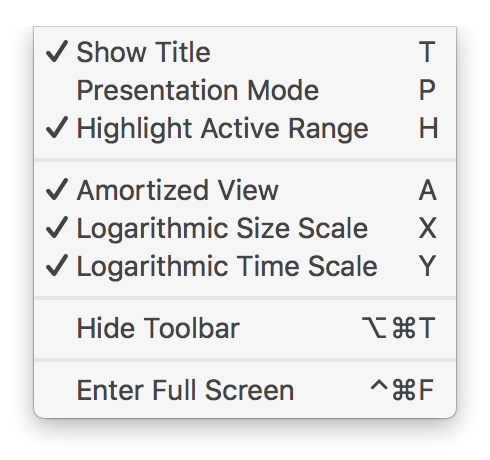

[](https://developer.apple.com/xcode/) 
[](https://developer.apple.com/platforms/)
[](https://travis-ci.org/lorentey/Attabench)

Attabench is a microbenchmarking app for macOS, designed to measure
and visualize the performance of Swift code.


### Table of Contents

<!-- START doctoc generated TOC please keep comment here to allow auto update -->
<!-- DON'T EDIT THIS SECTION, INSTEAD RE-RUN doctoc TO UPDATE -->


- [Background](#background)
- [Installation](#installation)
- [Usage](#usage)
- [Add New Benchmarks](#add-new-benchmarks)
- [Get Suprised by Results](#get-suprised-by-results)
- [Create Less Interesting Charts](#create-less-interesting-charts)

<!-- END doctoc generated TOC please keep comment here to allow auto update -->

## Background

Károly created Attabench because he wanted to include some log-log
charts in his [dotSwift 2017 talk][dotswift], and it seemed easier to
build a custom chart renderer from scratch using Core Graphics than
to mess with a bunch of CSV files and pivot tables in Excel.

[dotswift]: https://speakerdeck.com/lorentey/optimizing-swift-collections

Attabench was made in a hurry for a single use case, so its code is
what polite people might call *a little messy*. Károly thinks it's a
stinking pile of dog poo. Its UI design breaks new ground in making
Cocoa look bad. But it's shockingly fun to play with, and the graphs
it produces are chock full of strange and wonderful little mysteries.

(Károly does not usually refer to himself in the third person. He
doesn't really know why he started doing it now, and he hopes he'll
snap out of it soon.)

## Installation

90% the fun of Attabench is in defining and running your own
benchmarks. In order to do that, you currently need to build
Attabench from source.

1. Clone this repo to your Mac.

    ```
    git clone https://github.com/lorentey/Attabench.git Attabench
    cd Attabench
    ```

2. Install [Carthage][carthage] if you don't already have it. (This assumes you have [Homebrew][brew] installed.)

    ```
    brew install carthage
    ```

3. Retrieve and build dependencies ([SipHash][siphash], [BTree][btree] and [GlueKit][gluekit]).

    ```
    carthage bootstrap
    ```

4. Open the project file in Xcode 8.2, then build and run the Attabench target.

    ```
    open Attabench.xcodeproj
    ```

[carthage]: https://github.com/Carthage/Carthage
[brew]: https://brew.sh
[siphash]: https://github.com/lorentey/SipHash
[btree]: https://github.com/lorentey/BTree
[gluekit]: https://github.com/lorentey/GlueKit

## Usage

When the app starts up, it presents you with an empty chart. Press
Space to start running benchmarks with the parameters displayed in
the toolbar. The chart gets updated in real time as new measurements
are made.


The currently active size range is highlighted by a thick black line
on the size axis; the app cycles through all sizes in this range,
running all active benchmarks tasks for each of them. (You can
show/hide the highlight by pressing <kbd>H</kbd>.)

The chart is automatically scaled to fit all existing measurements for the active tasks and the entire active range.

To get a PNG version of the current chart, simply use the mouse to
drag the chart into Finder or another app. (You can also copy the
image to the clipboard by pressing Command-C.)

To explore the rest of the app, just look around the menu and click
around in the toolbar; I'm sure you'll quickly figure out how it
works.


## Add New Benchmarks

Benchmarks are currently compiled directly into the app, and cannot be changed at runtime. (I know, I know, this is awful. [Pull requests are welcome!][issue1])

[issue1]: https://github.com/lorentey/Attabench/issues/1

You can add new benchmarks or change existing ones by modifying the
source files of the `Benchmarks` target in the Xcode project. To
define a new benchmark, you need to create a new instance of the
`Benchmark<Input>` generic class and add some tasks to it.
    
```swift
public class Benchmark<Input>: BenchmarkProtocol {
    public let title: String
    public var descriptiveTitle: String? = nil
    public var descriptiveAmortizedTitle: String? = nil

    public init(title: String, inputGenerator: @escaping (Int) -> Input)
    public func addTask(title: String, _ body: @escaping (Input) -> ((BenchmarkTimer) -> Void)?)    
}
```

Each benchmark has an `Input` type parameter that defines the shared
input type that all tasks in that benchmark take. To create a
benchmark, you also need to supply a function that takes a size (a
positive integer) and returns an `Input` value of that size,
typically using some sort of random number generator.

For example, let's create a simple benchmark that measures raw lookup
performance in some standard collection types. To do that, we need to
generate two things as input: a list of elements that the collection should contain, and a sequence of lookup operations to perform.
We can represent both parts by randomly shuffling integers from 0 to `size - 1`, so that the order in which we insert elements into the collection will have no relation to the order we look them up:

```swift
let inputGenerator: (Int) -> (input: [Int], lookups: [Int]) = { size in
    return ((0 ..< size).shuffled(), (0 ..< size).shuffled())
}
```

Now that we have an input generator, we can start defining our benchmark:

```swift
let benchmark = Benchmark(title: "Sample", inputGenerator: inputGenerator)
benchmark.descriptiveTitle = "Time spent on all elements"
benchmark.descriptiveAmortizedTitle = "Average time spent on a single element"
```

We can add tasks to a benchmark by calling its `addTask` method.
Let's start with a task that measures linear search by calling `Array.contains` on the `input` array:

```swift
benchmark.addTask(title: "Array.contains") { (input, lookups) in
    guard input.count <= 16384 else { return nil }
    return { timer in
        for value in lookups {
            guard input.contains(value) else { fatalError() }
        }
    }
}
```

The syntax may look strange at first, because we're returning a
closure from within a closure, with the returned closure doing the
actual measurement. This looks complicated, but it allows for extra
functionality that's often important. In this case, we expect that the simple linear search implemented by `Array.contains` will be kind of slow, so to keep measurements fast, we limit the size of the input to about 16 thousand elements. Returning `nil` means that the task does not want to run on a particular input value, so it's curve will have a gap on the chart corresponding to that particular size.

The inner closure receives a `timer` parameter that can be used to
narrow the measurement to the section of the code we're actually interested in. For example, when we're measuring `Set.contains`, we aren't interested in the time needed to construct the set, so we need to exclude it from the measurement:

```swift
benchmark.addTask(title: "Set.contains") { (input, lookups) in
    return { timer in
        let set = Set(input)
        timer.measure {
            for i in lookups {
                guard set.contains(i) else { fatalError() }
            }
        }
    }
}
```

But preprocessing input data like this is actually better done
in the outer closure, so that repeated runs of the task will not waste time on setting up the environment again:

```swift
benchmark.addTask(title: "Set.contains") { (input, lookups) in
    let set = Set(input)
    return { timer in
        for value in lookups {
            guard set.contains(value) else { fatalError() }
        }
    }
}
```

This variant will go much faster the second and subsequent time the app runs it.

To make things a little more interesting let's add a third task that measures binary search in a sorted array:

```swift
benchmark.addJob(title: "Array.binarySearch") { input, lookups in
    let data = input.sorted()
    return { timer in 
        for value in lookups {
            var i = 0
            var j = array.count
            while i < j {
                let middle = i + (j - i) / 2
                if value > array[middle] {
                    i = middle + 1
                }
                else {
                    j = middle
                }
            }
            guard i < array.count && array[i] == value else { fatalError() }
        }
    }
}
```

That's it! To finish things off, we just need to modify the function `generateBenchmarks` in `Benchmarks.swift` to include our new benchmark in its return value, and recompile the app.

## Get Suprised by Results

Running our brand new benchmark gets us a chart like this one:


The chart uses logarithmic scale on both axis, and displays amortized
per-element execution time, where the elapsed time of each
measurement is divided by its size.

[loglog]: https://en.wikipedia.org/wiki/Log–log_plot

We can often gain suprisingly deep insights into the behavior of our
algorithms by just looking at the log-log charts generated by
Attabench. For example, let's try explaining some of the more obvious
features of the chart above:

 1. The curves start high. Looking up just a few members is
    relatively expensive compared to looking up many of them in a
    loop. Evidently there is some overhead (initializing iteration
    state, warming up the instruction cache etc.) that is a
    significant contributor to execution time at small sizes, but is gradually eclipsed by our algorithmic costs as we add more elements.
  
 2. Afer the initial warmup, the cost of looking up an element using
    `Array.contains` seems to be proportional to the size of the
    array. This is exactly what we expect, because linear search is
    supposed to be, well, linear. Still, it's nice to see this
    confirmed.
  
 3. The chart of `Set.contains` has a striking sawtooth pattern. This must be a side-effect of the particular way the set resizes itself to prevent an overly full hash table. At the peak of a sawtooth, the hash table is at full capacity (75% of its allocated space), leading to relatively frequent hash collisions, which slow down lookup operations. However, these
    collisions mostly disappear at the next size step, when the table is grown to double its previous size. So increasing the size of a `Set` sometimes makes it faster. Neat!

 4. In theory, `Set.contains` should be an O(1) operation, i.e., the time it takes should not depend on the size of the set. However, our benchmark indicates that's only true in practice when the set is small.

    Starting at about half a million elements, `contains` seems to
    switch gears to a non-constant curve: from then onwards, lookup
    costs consistently increase by a tiny amount whenever we double
    the size of the set. I believe this is because at 500,000
    elements, our benchmark's random access patterns overwhelm the
    [translation lookaside buffer][tlb] that makes our computers'
    virtual memory abstraction efficient. Even though the data still
    fits entirely in physical memory, it takes extra time to find the
    physical address of individual elements. 
    
    So when we have lots of data, randomly scattered memory accesses
    get really slow---and this can actually break the complexity
    analysis of our algorithms. Scandalous!
  
[tlb]: https://en.wikipedia.org/wiki/Translation_lookaside_buffer

 5. `Array.binarySearch` is [supposed to take O(log(n)) time][binsearch] to complete, but this is again proven incorrect for large arrays. At half a million elements, the curve for binary search bends upward exactly like like `Set.contains` did. It looks like the curve's slope is roughly doubled after the bend. Doubling the slope of a line on a log-log chart [squares the original function][loglog], i.e., the time complexity seems to have become O(log(n)*log(n)) instead of O(log(n)). 

    By simply looking at a chart, we've learned that at large scales,
    scattered memory access costs logarithmic time. Isn't that
    remarkable?

[binsearch]: https://en.wikipedia.org/wiki/Binary_search_algorithm

 6. Finally, `Array.binarySearch` has highly prominent spikes at powers-of-two sizes. This isn't some random benchmarking artifact; the spikes are in fact a feature built directly into the binary search algorithm that we wrote. I won't spoil the mystery this time: you should try explaining them on your own. What makes power-of-two sizes so special for binary search? Try changing the algorithm so that you optimize away the spikes without affecting the overall shape and position of the curve!

## Create Less Interesting Charts

A log-log chart displaying average time spent per element is usually
the best way to compare benchmark results, but if you wish to switch
to another chart type, just use the toggles in the View menu:



For example, here is the same chart in linear scale, displaying raw
execution times. 


Note how the `Array.contains` case is completely invisible---its 16k
cutoff is too small to even register on the horizontal axis. But the
other two curves don't fare too well, either: most of the features
that were so obvious on the log-log chart have disappeared. What
happened to that marvellous sawtooth pattern? What of the prominent
change of gears at 500,000 elements? At least the spikes of our
binary search are still visible, although they don't *pop* the way
they used to. Blergh!
